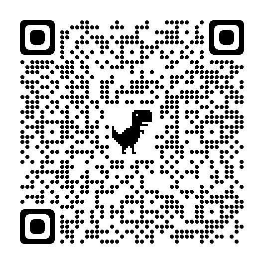
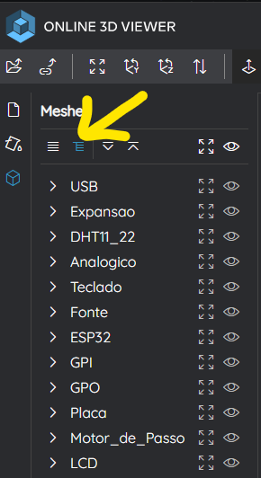
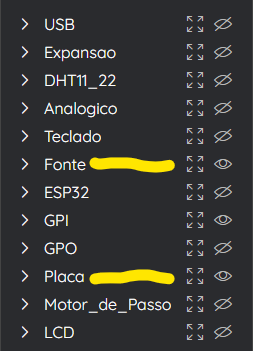

# Placa_ESP32_v01r04
## Modelo 3D da placa Didatica ESP32.
Link para acesso ao visualização em 3D On line:

https://3dviewer.net#model=https://raw.githubusercontent.com/DuffVonAxel/Placa_ESP32_v01r04/main/Placa_ESP32_v01r04.fbx

## No PC desktop:
Para ligar/desligar os grupos (GPI, GPO, etc) selecione o **menu**:

Para ver ou esconder de determinado grupo clique no **olho** correspondente, neste exemplo, somente a Placa e a Fonte estão visiveis:

